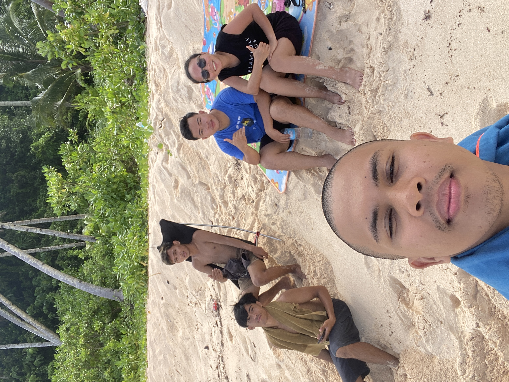
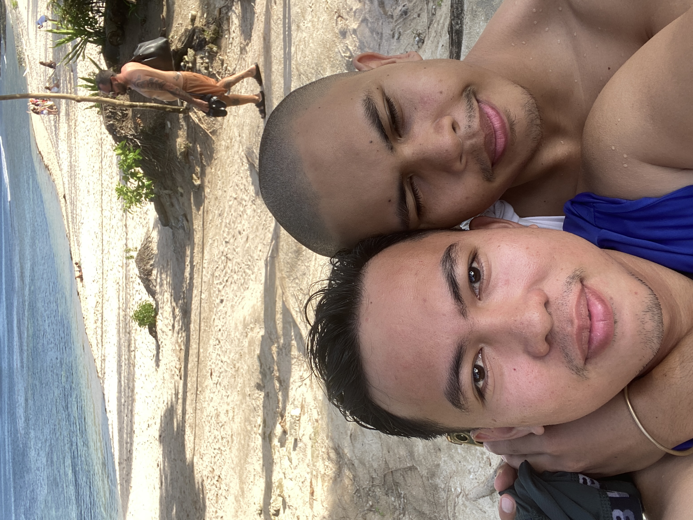

---
hide:
  - toc
---
<!--
CHECKLIST FOR THIS PAGE:
- [ ] Replace [YOUR NAME] with your full name (3 places)
- [ ] Replace [YOUR JOB TITLE] with your current or target role
- [ ] Replace [YOUR TAGLINE] with a short phrase describing your focus
- [ ] Rewrite the About Me paragraph with your own words
- [ ] Replace assets/images/profile.png with your actual photo (keep the filename or update it below)
- [ ] Replace assets/images/about.png with your own image (a field photo, map, or workspace shot)
- [ ] Edit the skill cards to match your actual skills (add, remove, or rename cards as needed)
- [ ] Update GitHub and LinkedIn links in the Connect section
- [ ] Add your CV PDF to docs/assets/ and update the filename in the Download CV button
-->

  
  <h1>Alex Maverick Pabillaran</h1>
  
<strong>Geospatial Intelligence for Climate-Smart Agriculture</strong>

  
<em>Agricultural & Biosystems Engineer specializing in GIS, Remote Sensing, and Earth Observation using QGIS and Google Earth Engine</em>

---

## About Me

I am an Agricultural and Biosystems Engineer specializing in GIS, Remote Sensing, and geospatial analytics for climate-smart agriculture and environmental systems.
I work on transforming satellite imagery and spatial datasets into actionable insights using QGIS, Google Earth Engine, and open-source geospatial technologies.
My work focuses on agricultural mapping, land suitability analysis, watershed and climate monitoring, and decision-support systems for resilient farming communities.
I am passionate about applying geospatial intelligence and Earth observation technologies to real-world challenges in food security, sustainability, and climate resilience,
and I am currently seeking opportunities in GIS, Remote Sensing, and Geospatial Analytics roles in both local and international environments.

  

---

[View My Projects :material-arrow-right:](projects/index.md){ .md-button .md-button--primary }
[Download CV :material-download:](assets/Alex Maverick Pabillaran Resume.pdf){ .md-button }

---

## Skills

-   :material-map-search:{ .lg .middle } **GIS & Remote Sensing**

    ---

    - QGIS
    - Google Earth Engine (GEE)
    - Remote Sensing Analysis
    - Land Use / Land Cover (LULC) Mapping
    - Spatial Analysis & Suitability Mapping
    - Watershed Delineation & Hydrological Analysis
    - Raster & Vector Geoprocessing
    - Cartography & Map Layout Design

-   :material-earth:{ .lg .middle } **Climate & Environmental Analytics**

    ---

    - NDVI & Vegetation Health Analysis
    - Rainfall & Climate Data Processing
    - Soil Moisture Mapping
    - Terrain & Slope Analysis
    - Agricultural & Environmental Monitoring
    - Climate-Smart Agriculture Applications

-   :material-database:{ .lg .middle } **Data Analytics & Geospatial Data**

    ---

    - Google Sheets & Microsoft Excel Analytics
    - Data Cleaning & Validation
    - Geospatial Data Management
    - GeoJSON, GeoTIFF, Shapefile
    - OpenStreetMap & Open Geospatial Datasets

-   :material-drone:{ .lg .middle } **Drone & Field Applications**

    ---

    - UAV Mission Planning
    - Drone-based Agricultural Monitoring
    - DJI Mavic 3 Air Operations
    - Field Data Collection & Ground Validation

-   :material-sprout:{ .lg .middle } **Agriculture & Decision Support**

    ---

    - Agricultural Resource Mapping
    - Land Suitability Analysis
    - Water Resources & Watershed Applications
    - GIS for Food Security & Sustainability
    - Decision Support for Climate-Resilient Agriculture

-   :material-satellite-variant:{ .lg .middle } **Remote Sensing & Image Classification**

    - Unsupervised Classification in Google Earth Engine
    - Supervised Classification using Google Earth Engine
    - Satellite Image Interpretation & Analysis
    - Sentinel-1 & Sentinel-2 Data Processing

---

## Connect

[GitHub](https://github.com/[alexmaverickp.github.io]){ .md-button }
[LinkedIn](https://linkedin.com/in/alex-m-p/){ .md-button }
