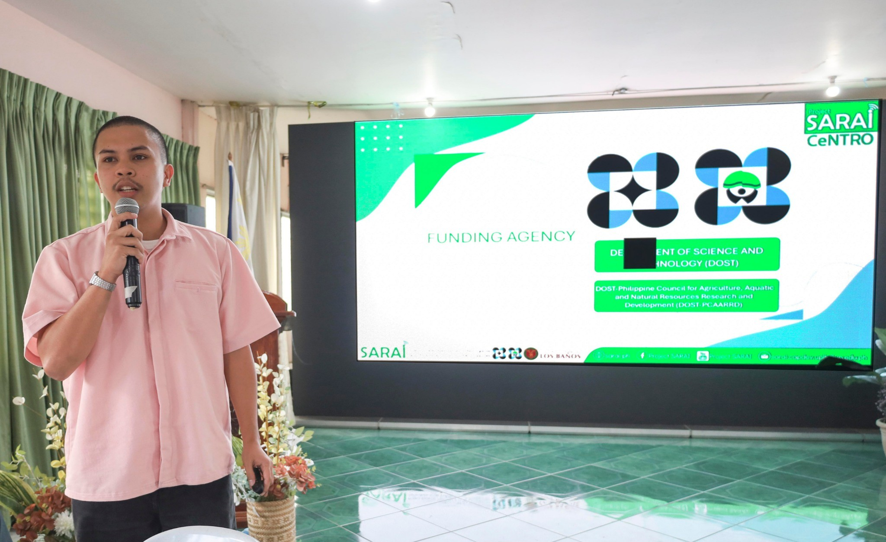

---
hide:
  - toc
---

  
  <h1>Alex Maverick Pabillaran</h1>
  
<strong>Geospatial Intelligence for Climate-Smart Agriculture</strong>

  
<em>Agricultural & Biosystems Engineer specializing in GIS, Remote Sensing, and Earth Observation using QGIS and Google Earth Engine</em>

---

## About Me

I am an Agricultural and Biosystems Engineer specializing in GIS, Remote Sensing, and geospatial analytics for climate-smart agriculture and environmental systems.
I work on transforming satellite imagery and spatial datasets into actionable insights using QGIS, Google Earth Engine, and open-source geospatial technologies.
My work focuses on agricultural mapping, land suitability analysis, watershed and climate monitoring, and decision-support systems for resilient farming communities.
I am passionate about applying geospatial intelligence and Earth observation technologies to real-world challenges in food security, sustainability, and climate resilience,
and I am currently seeking opportunities in GIS, Remote Sensing, and Geospatial Analytics roles in both local and international environments.

  

---

[View My Projects :material-arrow-right:](projects/index.md){ .md-button .md-button--primary }
[Download CV :material-download:](assets/assets/Alex Maverick Pabillaran Resume.v2.pdf){ .md-button }

---

## Skills

-   :material-map-search:{ .lg .middle } **GIS & Remote Sensing**

    ---

    - QGIS
    - Google Earth Engine (GEE)
    - Remote Sensing Analysis
    - Land Use / Land Cover (LULC) Mapping
    - Spatial Analysis & Suitability Mapping
    - Watershed Delineation & Hydrological Analysis
    - Raster & Vector Geoprocessing
    - Cartography & Map Layout Design

-   :material-earth:{ .lg .middle } **Climate & Environmental Analytics**

    ---

    - NDVI & Vegetation Health Analysis
    - Rainfall & Climate Data Processing (CHIRPS)
    - Soil Moisture Mapping
    - Terrain & Slope Analysis
    - Agricultural & Environmental Monitoring
    - Climate-Smart Agriculture Applications

-   :material-shield-alert:{ .lg .middle } **Hazard & Risk Mapping**

    ---

    - Flood Hazard Mapping (100-Year Return Period)
    - Landslide Hazard Mapping
    - Storm Surge Advisory Mapping (Levels 1–4)
    - ESA Copernicus DEM Processing
    - HEC-RAS Integration & Raster Analysis
    - Barangay-Level Geospatial Risk Assessment

-   :material-database:{ .lg .middle } **Data Analytics & Geospatial Data**

    ---

    - Google Sheets & Microsoft Excel Analytics
    - Data Cleaning & Validation
    - Geospatial Data Management
    - GeoJSON, GeoTIFF, Shapefile
    - OpenStreetMap & Open Geospatial Datasets

-   :material-drone:{ .lg .middle } **Drone & Field Applications**

    ---

    - UAV Mission Planning
    - Drone-based Aerial Photography
    - DJI Mavic 3 Air Operations
    - Field Surveys & Ground Validation
    - Discharge Measurement (Bucket & Float Methods)
    - Water Sample Collection

-   :material-sprout:{ .lg .middle } **Agriculture & Decision Support**

    ---

    - Agricultural Resource Mapping
    - Land Suitability Analysis
    - Water Resources & Watershed Applications
    - GIS for Food Security & Sustainability
    - Decision Support for Climate-Resilient Agriculture

-   :material-satellite-variant:{ .lg .middle } **Remote Sensing & Image Classification**

    ---

    - Unsupervised Classification in Google Earth Engine
    - Supervised Classification using Google Earth Engine
    - Satellite Image Interpretation & Analysis
    - Sentinel-1, Sentinel-2 & Landsat-8 Data Processing

 -   :material-ruler-square:{ .lg .middle } **Engineering Design**

    ---

    - Detailed Engineering Design (DED)
    - Program of Work (POW) & Unit Price Analysis
    - Farm Structure Design (Greenhouse, Cold Storage, Machinery Shed, Swine House)
    - AutoCAD
    - SketchUp & Enscape (3D Visualization)
    - Agricultural Infrastructure Planning

---

## Connect

[GitHub](https://github.com/alexmaverickp){ .md-button }
[LinkedIn](https://linkedin.com/in/alex-m-p/){ .md-button }