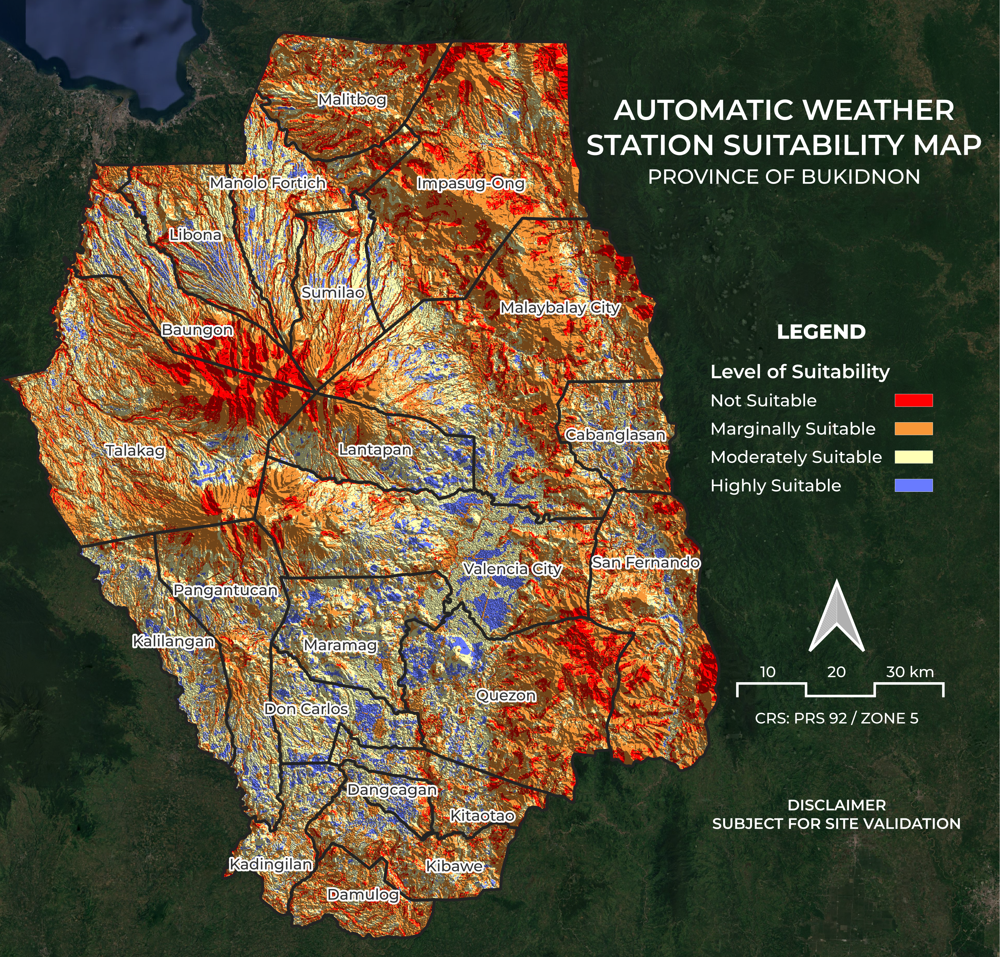

# Automatic Weather Station Suitability Map



## Overview

A GIS-based site suitability analysis identifying the most suitable locations for establishing Automatic Weather Stations (AWS) across the Province of Bukidnon, Philippines. Using the Analytic Hierarchy Process (AHP) as the multi-criteria decision framework, five spatial criteria were weighted and combined to produce a final suitability map classified into four levels — from Not Suitable to Highly Suitable — covering all municipalities of Bukidnon. The output is intended to support data-driven decision-making for weather monitoring infrastructure placement.

**Study Area:** Province of Bukidnon, Philippines — all municipalities  
**Role:** Solo project  
**Status:** Completed  
**CRS:** PRS 92 / Zone 5 (EPSG:3125)

> **Disclaimer:** Subject for site validation.

---

## Methods & Tools

**Data Sources**

| Dataset | Source |
|---------|--------|
| Land Use / Land Cover (10m, 2024) | Esri \| Sentinel-2 Land Cover Explorer |
| Digital Elevation Model (DEM) | USGS SRTMGL1 003 via Google Earth Engine |
| Road Network | OpenStreetMap Philippines via Geofabrik Download Server |
| River & Water Bodies | OpenStreetMap Philippines via Geofabrik Download Server |
| Existing AWS Locations | PAG-ASA Mindanao (Philippine Atmospheric, Geophysical and Astronomical Services Administration) |
| Administrative Boundaries | GADM (Global Administrative Areas) via QGIS Plugin |

**Suitability Criteria & Scoring**

Criteria scoring was based on Felipe *et al*. (2024) as adopted by Dawis *et al*. (2025):

| Criteria | Highly Suitable (3) | Moderately Suitable (2) | Marginally Suitable (1) | Not Suitable (0) |
|----------|--------------------|-----------------------|------------------------|-----------------|
| Slope | ≤ 5% | 5–15% | 15–25% | ≥ 25% |
| Land Use / Land Cover | Class 40 | Classes 20, 30, 60 | Class > 100 | Classes 0, 50, 80, 90 |
| Distance to Water Bodies | ≥ 1 km | 0.5–1 km | 0.25–0.5 km | ≤ 0.025 km |
| Distance to Roads | 0–0.7 km | 0.7–1.2 km | 1.2–2.2 km | ≤ 0.3 / ≥ 2 km |
| Distance to Existing AWS | ≥ 9 km | 5–9 km | 3–5 km | ≤ 3 km |

**AHP Weights**

Criteria weights were derived using the Analytic Hierarchy Process:

| Criteria | Weight |
|----------|--------|
| Slope | 0.220 |
| Land Use / Land Cover | 0.223 |
| Distance to Roads | 0.185 |
| Distance to Water Bodies | 0.166 |
| Distance to Existing AWS | 0.205 |

**Final Suitability Index Formula (Raster Calculator)**

```
( [Suitability] Slope    × 0.220 ) +
( [Suitability] LULC     × 0.223 ) +
( [Suitability] Road     × 0.185 ) +
( [Suitability] Water    × 0.166 ) +
( [Suitability] AWS      × 0.205 )
```

**Processing Workflow**

The full analysis was conducted in QGIS and Google Earth Engine following these stages:

**Stage 1 — Data Acquisition**

- Downloaded Sentinel-2 LULC GeoTIFFs (2024) from Esri Land Cover Explorer and uploaded to GEE as image assets
- Extracted DEM (SRTMGL1) for Bukidnon from GEE and exported to Google Drive
- Downloaded OSM road, waterway, and water body shapefiles from Geofabrik
- Uploaded Bukidnon municipality boundary shapefile as a GEE and QGIS asset

**Stage 2 — Preprocessing in QGIS**

- Clipped road, waterway, water body, and existing AWS layers to the Bukidnon municipality boundary
- Converted water body polygons to lines for proximity analysis
- Merged waterway and converted water body layers into a single water network layer
- Converted DEM elevation to slope (degrees) using QGIS Raster Analysis > Slope
- Reprojected all raster layers (Slope, LULC) and vector layers (Water, Road, AWS) to PRS 92 / Zone 5 (EPSG:3125)

**Stage 3 — Rasterization & Proximity**

- Rasterized road and water network vector layers to 30m resolution
- Rasterized existing AWS point layer to the same extent and resolution
- Generated proximity (raster distance) maps for road, water, and AWS rasters using QGIS Raster Analysis > Proximity

**Stage 4 — Reclassification**

Each criteria layer was reclassified to a 0–3 suitability score using QGIS Raster Analysis > Reclassify by Table:

- **Slope** — 0–2.9° → 3, 2.9–8.5° → 2, 8.5–14° → 1, 14–90° → 0
- **LULC** — Crops (5) → 3, Bare Ground (8) / Rangeland (11) → 2, Trees (2) → 1, Water / Flooded / Built / Clouds → 0
- **Distance to Water** — 0–25m → 0, 25–1000m → 1, 1000m+ → 3
- **Distance to Roads** — 0–300m → 3, 300–700m → 3, 700–1200m → 2, 1200–2200m → 1, 2200m+ → 0
- **Distance to AWS** — 0–3000m → 0, 3000–5000m → 1, 5000–9000m → 2, 9000m+ → 3

**Stage 5 — AHP Weighted Overlay & Final Classification**

- Applied the AHP formula in QGIS Raster Calculator to produce a continuous Suitability Index
- Reclassified the index into four final classes: Not Suitable (0–0.75), Marginally Suitable (0.75–1.50), Moderately Suitable (1.50–2.25), Highly Suitable (2.25–3.00)
- Styled and exported the final map with municipal boundaries, legend, north arrow, and scale bar in QGIS Print Layout

**Tools Used**

| Tool | Purpose |
|------|---------|
| QGIS | All geoprocessing — clip, reproject, slope, rasterize, proximity, reclassify, raster calculator, map layout |
| Google Earth Engine | DEM and LULC extraction, asset management, and export to Google Drive |
| Claude AI | Code assistance, documentation, and project write-up |

---

## Suitability Legend

| Color | Class |
|-------|-------|
| 🟥 Red | Not Suitable |
| 🟧 Orange | Marginally Suitable |
| 🟨 Yellow | Moderately Suitable |
| 🟦 Blue | Highly Suitable |

---

## References

- Felipe, A. J. B., Magallanes, J. G., and Abriol, M. P. (2024). Suitability evaluation of existing agrometeorological network in Luzon, Philippines using GIS-based Analytical Hierarchy Process (AHP). *Kyushu University Institutional Repository*. [https://doi.org/10.5109/7323241](https://doi.org/10.5109/7323241)
- Dawis, D. M. K., Dizon, D. A. V., Castino, E. R., Cuizon, A. C., and Teñido, M. N. (2025). GIS-based suitability analysis of agrometeorological stations in Pampanga, Philippines. *Journal of Agrometeorology*, 27(2): 205–209. [https://doi.org/10.54386/jam.v27i2.2875](https://doi.org/10.54386/jam.v27i2.2875)
- Esri / Impact Observatory. *Sentinel-2 10m Land Use/Land Cover* [Dataset]. Retrieved from [https://livingatlas.arcgis.com/landcoverexplorer](https://livingatlas.arcgis.com/landcoverexplorer)
- USGS / NASA. *SRTMGL1: NASA SRTM Digital Elevation 30m* [Dataset]. Google Earth Engine. Retrieved from [https://developers.google.com/earth-engine/datasets/catalog/USGS_SRTMGL1_003](https://developers.google.com/earth-engine/datasets/catalog/USGS_SRTMGL1_003)
- Geofabrik. *OpenStreetMap Data for Philippines* [Dataset]. Retrieved from [https://download.geofabrik.de/asia/philippines.html](https://download.geofabrik.de/asia/philippines.html)
