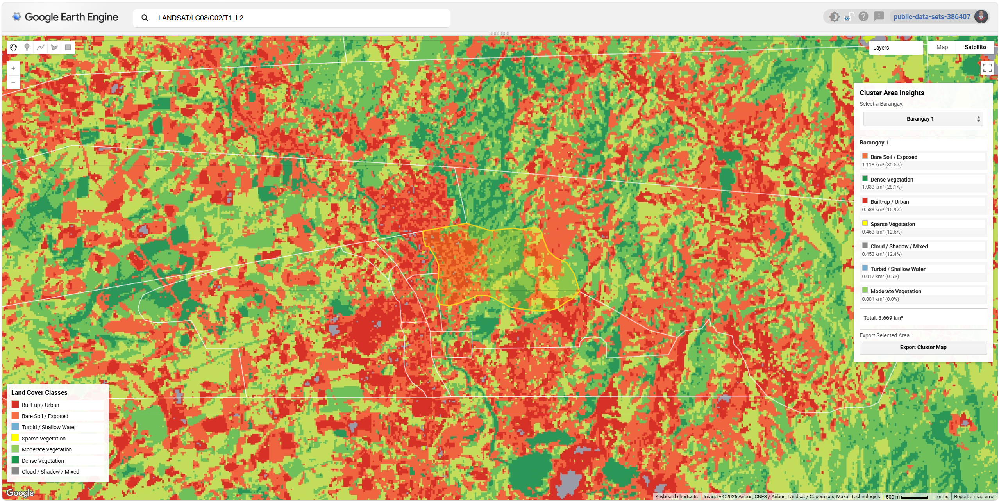

---
hide:
  - toc
---

# Projects

A selection of my geospatial projects. Click any card to see the full write-up.

**[Nature-based Solution: Proposed Riparian Buffer Restoration and Protection Strategy for Pulangui River Basin, Bukidnon](pulangui.md)**

This project proposes a nature-based riparian buffer restoration and protection strategy for the Pulangui River Basin in Bukidnon, Philippines, using GIS-based watershed analysis to identify sediment-prone and degraded riparian zones requiring ecological restoration. The workflow integrates terrain analysis, hydrologic modeling, land cover exposure, and riparian buffer assessment to support flood resilience and sustainable watershed management through spatially explicit planning.

The project was developed as an entry to the Geographic Innovations for Development Solutions, Inc. (GRIDS) Mapping Contest with the theme: Enhancing flood management and resilience through nature-based solutions, and was awarded a Consolation Prize.

`QGIS` `Google Earth Engine` `ChatGPT Plus`

[View Project →](pulangui.md){ .md-button }

**[Remote Sensing NDVI Tool](ndvi-tool.md)**

An interactive web application built on Google Earth Engine that calculates and visualizes the Normalized Difference Vegetation Index (NDVI) for all provinces of the Northern Mindanao Region (Region X), Philippines. Designed as a passion project and presented at an exhibit, the app makes satellite remote sensing engaging and understandable for young audiences — turning complex geospatial science into a hands-on, visual experience.

`Google Earth Engine` `ChatGPT Plus` `Claude AI`

[View Project →](ndvi-tool.md){ .md-button }

**[Unsupervised Land Cover Classification](unsupervised-classification.md)**

A machine learning project applying unsupervised K-Means clustering to Landsat 8 satellite imagery to classify land cover across Malaybalay City, Bukidnon, Philippines — down to the barangay level. Built as a personal initiative to explore machine learning in the context of remote sensing, the app generates a 7-class land cover map and provides an interactive barangay-level insight panel with per-class area statistics and export capability.

`Google Earth Engine` `Claude AI`

[View Project →](unsupervised-classification.md){ .md-button }

