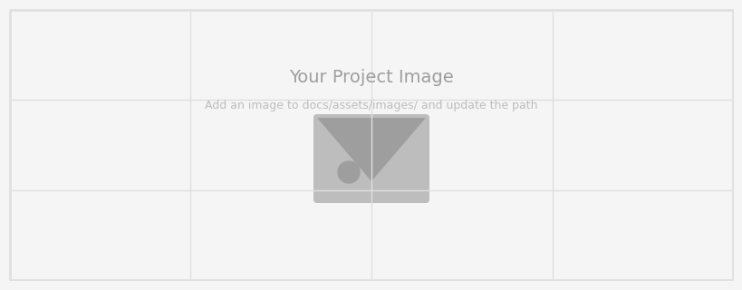

---
hide:
  - toc
---
<!--
CHECKLIST FOR THIS PAGE:
- [ ] Replace the two placeholder cards (marked [YOUR PROJECT ...]) with your real projects
- [ ] For each project: add a thumbnail image to docs/assets/images/ and update the path below
- [ ] For each project: create a project page by copying sample-project.md
- [ ] For each project: add a nav entry in mkdocs.yml (see the comments there)
- [ ] Delete placeholder cards you don't need yet
-->

# Projects

A selection of my geospatial projects. Click any card to see the full write-up.

**[Nature-based Solution: Proposed Riparian Buffer Restoration and Protection Strategy for Pulangui River Basin, Bukidnon](pulangui.md)**

This project proposes a nature-based riparian buffer restoration and protection strategy for the Pulangui River Basin in Bukidnon, Philippines, using GIS and remote sensing to identify degraded zones and prioritize restoration areas. The work aims to support sustainable watershed management through evidence-based, spatially explicit planning. This project was submitted to a competition organized by Geographic Innovations for Development Solutions, Inc. on Nature-based Solutions in your locality, and was awarded a Consolation Prize.

`QGIS` `Google Earth Engine`

[View Project →](sample-project.md){ .md-button }

**[Sample Notebook](sample-notebook.ipynb)**

[YOUR PROJECT DESCRIPTION — one or two sentences: what you did, what data you used,
and what you found or built.]

`Python` `pandas` `Folium`

[View Project →](sample-notebook.ipynb){ .md-button }

