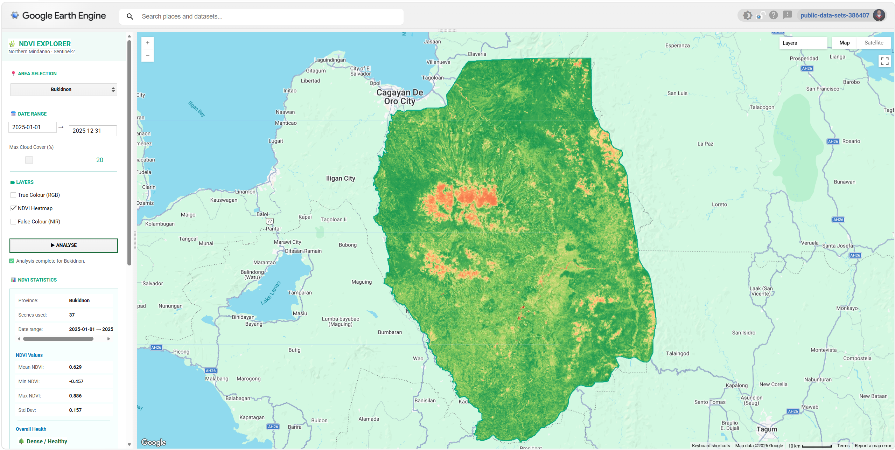

# Remote Sensing NDVI Tool

## Overview

An interactive web application built on Google Earth Engine that calculates and visualizes the Normalized Difference Vegetation Index (NDVI) for all provinces of the Northern Mindanao Region (Region X), Philippines. Designed as a passion project and presented at an exhibit, the app makes satellite remote sensing engaging and understandable for young audiences — turning complex geospatial science into a hands-on, visual experience.

**Study Area:** Northern Mindanao Region (Region X), Philippines — all provinces  
**Role:** Solo project  
**Status:** Completed

---

## Methods & Tools

**Data Sources**

- Copernicus Sentinel-2 Harmonized (L1C) — multispectral satellite imagery via Google Earth Engine
- FAO GAUL Simplified 500m 2015 (Level 2) — provincial administrative boundaries via Google Earth Engine

**Processing Steps**

1. Filtered the Sentinel-2 Harmonized image collection by user-selected date range, province boundary, and maximum cloud cover percentage
2. Applied a median composite to reduce cloud noise across multiple scenes
3. Computed NDVI per pixel using the formula: `(NIR – Red) / (NIR + Red)` using Bands B8 and B4
4. Clipped the output to the selected province boundary from FAO GAUL 2015
5. Classified pixels into five NDVI classes: Water/Non-veg, Bare/Urban, Sparse Vegetation, Moderate Vegetation, and Dense/Healthy Vegetation
6. Calculated per-class area coverage in km² and derived summary statistics (mean, min, max, std dev)

**Tools Used**

| Tool | Purpose |
|------|---------|
| Google Earth Engine | Satellite imagery processing, NDVI computation, area statistics, and interactive map rendering |
| JavaScript (GEE Code Editor) | App scripting, UI panel design, and dynamic layer control |
| ChatGPT Plus | Logic drafting and development assistance |
| Claude AI | Code refinement, documentation, and project write-up |

---

## Key Features

- **Province-level NDVI Maps** — Generates a color-coded NDVI heatmap (red → yellow → green) for any selected province in Region X, clearly showing areas from bare/urban land to dense, healthy forest
- **Interactive Date Range Selector** — Users can define a custom start and end date tied to Sentinel-2 availability, allowing comparison of vegetation health across different seasons or years
- **Cloud Cover Filter** — A slider lets users set the maximum cloud cover percentage, ensuring cleaner and more accurate imagery composites
- **Multi-layer Toggle** — Switch between True Colour RGB, NDVI Heatmap, and False Colour (NIR) views independently
- **NDVI Statistics Panel** — After each analysis, the app displays mean, min, max, and standard deviation of NDVI, an overall vegetation health rating, and area breakdown by class in km²
- **Exhibit-Ready Design** — Built with a clean, intuitive side panel UI designed to be accessible and fun for young audiences at a public exhibit

---

## Sample Output — Bukidnon Province (2025)

The screenshot above shows the app's output for **Bukidnon**, analyzed using 37 Sentinel-2 scenes from January to December 2025 with a 20% maximum cloud cover filter.

| Metric | Value |
|--------|-------|
| Scenes Used | 37 |
| Mean NDVI | 0.629 |
| Min NDVI | -0.457 |
| Max NDVI | 0.886 |
| Std Dev | 0.157 |
| Overall Health | 🌳 Dense / Healthy |

**Area by Class (km²)**

| Class | Area |
|-------|------|
| Water / Non-veg | 22.6 km² |
| Bare / Urban | 228.7 km² |
| Sparse Vegetation | 542.6 km² |
| Moderate Vegetation | 2,109.2 km² |
| Dense / Healthy | 6,152.2 km² |

The NDVI heatmap reveals that the vast majority of Bukidnon is covered by dense, healthy vegetation (dark green), with clusters of sparse or stressed vegetation (orange/red) concentrated around urban centers and agricultural zones in the province's interior highlands.

---

## NDVI Legend

| Color | Class | NDVI Range |
|-------|-------|------------|
| 🟥 Red | Water / Bare | NDVI < 0 |
| 🟧 Orange | Sparse Veg. | 0.0 – 0.2 |
| 🟨 Yellow | Moderate | 0.2 – 0.4 |
| 🟩 Light Green | Healthy Veg. | 0.4 – 0.6 |
| 🟢 Dark Green | Dense Forest | 0.6 – 1.0 |

---

## References

- Copernicus / ESA. *Sentinel-2 Harmonized* [Dataset]. Google Earth Engine. Retrieved from [https://developers.google.com/earth-engine/datasets/catalog/COPERNICUS_S2_HARMONIZED](https://developers.google.com/earth-engine/datasets/catalog/COPERNICUS_S2_HARMONIZED)
- Food and Agriculture Organization of the United Nations. *FAO GAUL Simplified 500m 2015 Level 2* [Dataset]. Google Earth Engine. Retrieved from [https://developers.google.com/earth-engine/datasets/catalog/FAO_GAUL_SIMPLIFIED_500m_2015_level2](https://developers.google.com/earth-engine/datasets/catalog/FAO_GAUL_SIMPLIFIED_500m_2015_level2)

---

## Links

[View App on Google Earth Engine](https://code.earthengine.google.com/ac3b538fe10abc7ded6e8223b369d0b6){ .md-button }
[Sentinel-2 Dataset](https://developers.google.com/earth-engine/datasets/catalog/COPERNICUS_S2_HARMONIZED){ .md-button }
[FAO GAUL 2015 Boundaries](https://developers.google.com/earth-engine/datasets/catalog/FAO_GAUL_SIMPLIFIED_500m_2015_level2){ .md-button }
