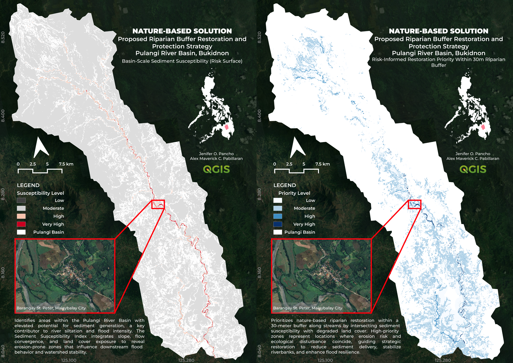

## Overview

Flooding and river siltation within the Pulangi River Basin are strongly influenced by upstream erosion, degraded riparian corridors, and sediment transport processes. This project applies GIS-based spatial analysis to identify erosion-prone areas and prioritize riparian restoration zones using a Nature-Based Solutions (NbS) approach.

The workflow integrates terrain analysis, hydrologic modeling, land cover exposure, and riparian buffer assessment to support risk-informed restoration planning for watershed resilience and flood mitigation in Bukidnon, Philippines.

This project was developed using entirely open-source geospatial workflows in QGIS and SAGA GIS.

---

## Study Area

**Pulangi River Basin, Bukidnon, Philippines**

The Pulangi River Basin is one of the major river systems in Mindanao and plays a critical role in agriculture, water resources, and downstream hydrologic stability. Increasing land cover disturbance and riparian degradation contribute to sediment generation and river instability, making the basin suitable for watershed-scale restoration prioritization.

---

## Project Objectives

- Identify areas with elevated sediment susceptibility across the watershed
- Detect degraded riparian corridors requiring ecological restoration
- Prioritize restoration zones using spatial risk analysis
- Support flood resilience planning through Nature-Based Solutions (NbS)

---

## Methodology

### 1. Basin-Scale Sediment Susceptibility Modeling

A **Sediment Susceptibility Index (SSI)** was developed using three measurable watershed components:

- Slope gradient
- Flow accumulation (runoff convergence)
- Land cover exposure

Normalized raster layers were combined through weighted overlay analysis to identify erosion-prone and sediment-generating areas within the basin.

The SSI workflow avoided unsupported assumptions commonly used in generalized erosion models by relying only on observable and spatially measurable terrain and land cover variables.

---

### 2. Riparian Restoration Prioritization

A **30-meter riparian buffer** was generated along extracted stream networks to represent ecologically sensitive river corridors.

Restoration priority zones were identified by intersecting:

- High sediment susceptibility areas
- Degraded land cover classes
- Riparian buffer zones

The resulting priority surface highlights areas where erosion risk and ecological disturbance coincide, guiding strategic riparian restoration and riverbank stabilization efforts.

---

## Data Sources

- Copernicus DEM 30m
- HydroATLAS / HydroSHEDS
- ESRI Sentinel-2 Land Cover 2024
- OpenStreetMap Basemap
- Google Satellite Imagery (visual validation)

---

## Software & Tools

- QGIS
- SAGA GIS
- GDAL
- Google Earth Engine
- ChatGPT Plus

---

## Key Outputs

### Basin-Scale Sediment Susceptibility Surface

This output identifies areas with elevated potential for sediment generation, a major contributor to river siltation and downstream flood intensity.

---

### Risk-Informed Riparian Restoration Priority

This output prioritizes restoration zones within a 30-meter riparian corridor where sediment susceptibility and degraded land cover intersect.

High-priority areas indicate locations where restoration may provide the greatest ecological and hydrologic benefits.

---

## Key Insights

- High sediment susceptibility frequently aligns with exposed and disturbed river corridors
- Forested regions generally exhibit lower restoration priority due to reduced erosion exposure
- Priority restoration zones cluster near stream-adjacent agricultural and degraded landscapes
- Riparian restoration can serve as a strategic Nature-Based Solution for reducing sediment delivery and improving watershed resilience

---

## Validation

Spatial outputs were visually validated using high-resolution satellite imagery to assess correspondence between modeled high-priority areas and observable riparian disturbance patterns.

Validation showed that many high-priority zones coincided with exposed riverbanks, cultivated floodplains, and degraded vegetation corridors.

---

## Relevance to Nature-Based Solutions (NbS)

This project demonstrates how GIS and spatial analysis can support proactive watershed management through ecological restoration strategies rather than purely structural flood interventions.

By identifying where riparian restoration may produce the greatest watershed benefit, the project contributes to:

- Flood resilience enhancement
- Sediment reduction
- Riverbank stabilization
- Watershed protection
- Ecosystem restoration planning

---
