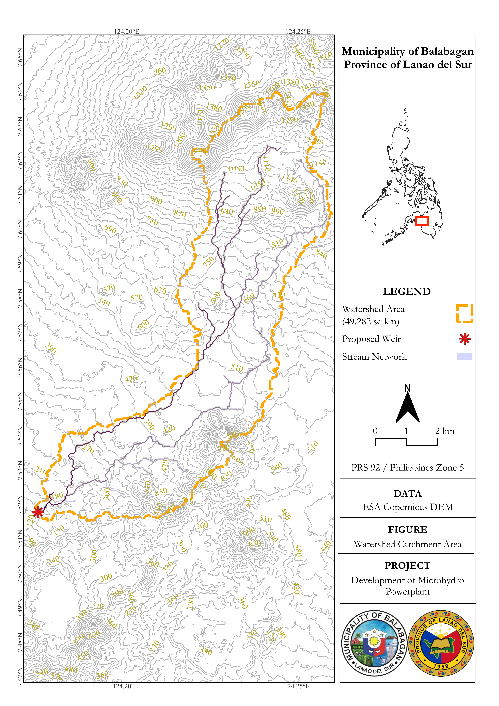

# Watershed Catchment Area Mapping for Microhydro Powerplant Development

**Role:** GIS Analyst and Field Survey Support  
**Study Area:** Municipality of Balabagan, Province of Lanao del Sur, Philippines  
**Type:** Geospatial Analysis and Field Validation — Feasibility Study Phase  
**Outcome:** Concluded Infeasible

---

## Overview

This project involved delineating and mapping the watershed catchment area of a proposed weir site along the Budas River in Balabagan, Lanao del Sur, to support the feasibility assessment of a microhydro powerplant. A single pour point was placed at the proposed weir location to establish the contributing drainage area, which would inform hydrological design parameters for the powerplant.

Field validation was conducted alongside the GIS analysis. Discharge measurements taken at the proposed weir site during the site visit recorded insufficient flow to support microhydro development. Local community members confirmed this was atypical, the visit coincided with a drought season, a condition they had not previously experienced to this extent. Based on the combination of spatial analysis and field-observed discharge data, the project was **concluded as not feasible** under prevailing hydrological conditions.

All deliverables were produced in **PRS 92 / Philippines Zone 5 (EPSG:3125)**, the required coordinate reference system for local government and national agency submissions in the Philippines.

---

## Map Output

The map presents the delineated watershed catchment boundary for the proposed weir site, with the Budas River stream network and topographic contours overlaid to characterize the drainage terrain.

| Feature | Detail |
|---|---|
| Watershed Area | 49.282 sq.km |
| Elevation Range | ~120 m – ~1,470 m ASL |
| Stream Network | Budas River and tributaries |
| CRS | PRS 92 / Philippines Zone 5 (EPSG:3125) |
| Data | ESA Copernicus DEM GLO-30 |

The catchment spans high-relief mountainous terrain, with a significant elevation gradient from the proposed weir at ~120 m ASL up to over 1,400 m at the upper watershed divide. Under normal hydrological conditions, this gradient would indicate run-of-river potential. However, field-measured discharge during the site visit did not meet the minimum threshold for viable microhydro development.

*Data: ESA Copernicus DEM GLO-30 | CRS: PRS 92 / Philippines Zone 5 (EPSG:3125)*

---

## Methods

### Data Sources

| Source | Use |
|---|---|
| ESA Copernicus DEM GLO-30 | Terrain base for hydrologic analysis |
| Google Earth Engine | DEM acquisition and export |
| Hydrologic raster derivatives | Flow accumulation, drainage direction, stream network |
| GPS Field Survey | Weir site coordinates and discharge measurement points |

### Processing Steps

1. Acquired and exported DEM data using Google Earth Engine
2. Reprojected terrain data to PRS 92 / Philippines Zone 5 (EPSG:3125)
3. Preprocessed the DEM through sink filling and hydrologic conditioning
4. Generated flow accumulation, drainage direction, and stream network rasters
5. Placed pour point at the proposed weir location along the Budas River
6. Delineated watershed catchment boundary from the pour point
7. Calculated catchment area and produced cartographic output with topographic contours for feasibility reporting

### Tools

| Tool | Purpose |
|---|---|
| QGIS + GRASS GIS | DEM preprocessing, watershed delineation, stream network extraction, cartographic layout |
| Google Earth Engine | DEM acquisition and export |
| DJI Mavic 3 Air | Aerial photography for site documentation |

---

## Field Validation

On-site, discharge measurements were taken at the proposed weir location along the Budas River using bucket and float methods. Measured flow was insufficient to support microhydro powerplant development. Local community members were consulted during the visit and confirmed that the observed low-flow conditions were unusual, attributing them to an ongoing drought season that they had not previously experienced to this degree.

Aerial photography of the proposed weir site and surrounding terrain was also captured using a **DJI Mavic 3 Air** for site documentation and visual reference.

---

## Feasibility Conclusion

Based on the watershed analysis and field discharge measurements, the proposed microhydro powerplant was **concluded as not feasible** under the hydrological conditions observed during the site visit. The insufficient discharge, compounded by community testimony indicating drought-season anomaly. Raised sufficient uncertainty about reliable year-round flow to support the powerplant's operational requirements.

The watershed catchment area (49.282 sq.km) and terrain characteristics would otherwise present a promising spatial footprint for run-of-river microhydro under normal hydrological conditions. A follow-up dry and wet season discharge monitoring programme would be recommended before any future reassessment.

---

## Skills Demonstrated

- Watershed delineation and pour point analysis
- DEM preprocessing and hydrologic conditioning (QGIS + GRASS GIS)
- Stream network extraction and terrain characterization
- Cartographic layout production (PRS 92 / Philippines Zone 5)
- Field discharge measurement (bucket and float methods)
- Community consultation and ground truth validation
- DJI Mavic 3 Air aerial photography
- Feasibility assessment and spatial decision support

---

> This project was conducted as part of a broader feasibility study engagement in Balabagan, Lanao del Sur. Field data and map outputs are available for review on request during a hiring process.
