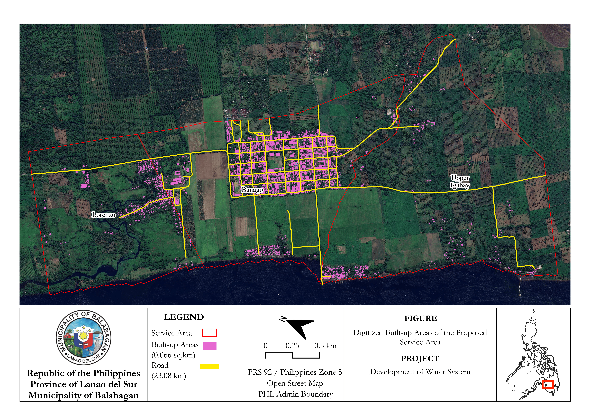
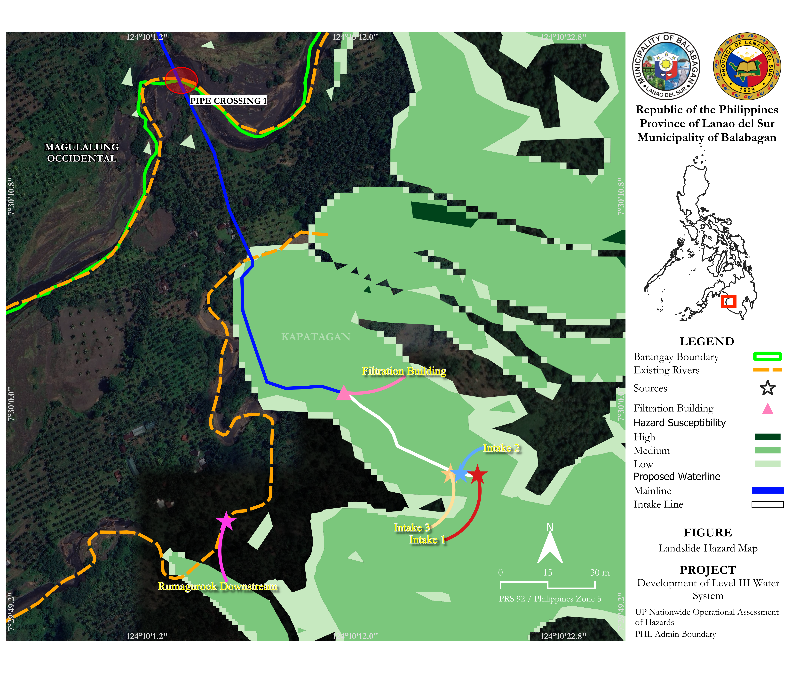
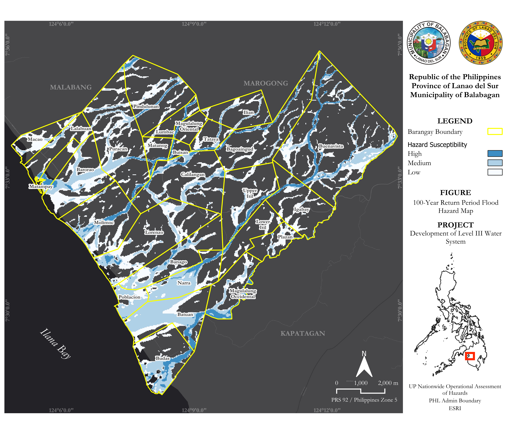

# Water System Planning Support Through GIS Mapping, Watershed Analysis, and Hazard Assessment

**Role:** GIS Analyst, Cartographer, and Field Survey Support  
**Study Area:** Municipality of Balabagan, Province of Lanao del Sur, Philippines  
**Type:** Independent GIS Consulting — Feasibility Study Phase  

---

## Overview

This project provided GIS mapping, watershed analysis, and spatial decision support for a Level III water system feasibility assessment in Balabagan, Lanao del Sur, a coastal municipality in the Bangsamoro Autonomous Region in Muslim Mindanao (BARMM). The engagement combined desktop GIS analysis with direct field survey participation, producing **13 report-ready map layouts** and a watershed catchment analysis alongside a verified spatial dataset of intake sources and survey points.

Desktop work covered watershed delineation of the Budas River intake area, service area delineation, infrastructure layout mapping, and natural hazard assessment across flood, landslide, and storm surge exposure. In the field, I served as the GIS and geotagging specialist within a three-person team, responsible for GPS geotagging of proposed intake sources, survey point recording, and survey coordinate management, while the other members handled rodman duties and the RTK receiver. Field-collected coordinates were subsequently verified against GIS-derived reference points in Google Earth Pro and integrated directly into the map outputs.

All deliverables were produced in **PRS 92 / Philippines Zone 5 (EPSG:3125)**, the required coordinate reference system for local government and national agency submissions in the Philippines.

---

## Selected Map Outputs

### Watershed Catchment Analysis

Prior to infrastructure mapping, watershed catchment delineation was performed along the Budas River to identify and evaluate viable intake source locations. Four pour point scenarios were analyzed to assess the range of contributing drainage areas available for system supply.

| Pour Point | Coordinates | Catchment Area |
|---|---|---|
| Original (Red) | 7°29'56.1"N 124°10'17.2"E | 0.056 sq.km |
| Blue | 7°29'52.1"N 124°09'58.0"E | 0.86 sq.km |
| Green | 7°29'48.1"N 124°09'37.3"E | 1.92 sq.km |
| Pink/Magenta | 7°29'48.3"N 124°09'34.4"E | 40.54 sq.km |

The Budas River stream network and topographic contours were overlaid to support site assessment and intake source evaluation. Catchment outputs directly informed the intake siting decisions reflected in the infrastructure layout maps.

*Data: ESA Copernicus DEM GLO-30 | CRS: PRS 92 / Philippines Zone 5 (EPSG:3125)*

---

### Service Area Map — Digitized Built-up Areas

The service area was delineated to cover the proposed distribution footprint of the Level III water system, encompassing barangays including Banago, Lorenzo, and Upper Igabay along the Ilana Bay coastal zone. Built-up areas were manually digitised from high-resolution satellite imagery, yielding a total digitised built-up area of **0.066 sq.km**, establishing the population centre coverage for system design. The road network within the service area was mapped at **23.08 km** total length, providing the alignment reference for proposed waterline routing.

*Data sources: OpenStreetMap, PHL Admin Boundary | CRS: PRS 92 / Philippines Zone 5*

---

### Landslide Hazard Map — Rumagurook Intake Site

Site-scale landslide hazard map for the Rumagurook intake area, integrating UP NOAH susceptibility data (High / Medium / Low) with the proposed infrastructure layout: Intake 1, 2, and 3 (star symbols); Filtration Building (pink triangle); Mainline (blue); Intake Line (white); and Pipe Crossing 1 (red circle) at the stream crossing. Rumagurook Downstream is marked as a downstream reference.

The proposed intake points fall within low-to-medium susceptibility zones, while the mainline route traverses mixed susceptibility terrain — spatial information directly applicable to engineering risk assessment and pipeline route refinement.

*Data: UP Nationwide Operational Assessment of Hazards (UP NOAH), PHL Admin Boundary | CRS: PRS 92 / Philippines Zone 5*

---

### 100-Year Return Period Flood Hazard Map — Municipality of Balabagan

Municipality-wide flood susceptibility map covering all 22 barangays of Balabagan, classified from UP NOAH 100-Year return period data into High (dark blue), Medium (light blue), and Low (white) zones. Coastal barangays fringing Ilana Bay carry the highest flood exposure, with hazard concentrations along stream corridors and coastal lowlands. Barangays further inland show comparatively lower susceptibility, a pattern that directly informed infrastructure siting decisions for the intake and service area.

*Data: UP NOAH, PHL Admin Boundary, ESRI | CRS: PRS 92 / Philippines Zone 5*

---

## Methods

### Data Sources

| Source | Use |
|---|---|
| ESA Copernicus DEM GLO-30 | Watershed delineation and terrain analysis |
| Google Earth Engine | DEM acquisition and export |
| Google Earth Pro | Waterline layout and survey point verification |
| UP NOAH | Flood, landslide, and storm surge hazard data |
| Google Satellite / ESRI Basemap | Map layout backgrounds |
| OpenStreetMap | Road network and administrative boundaries |
| LGU Balabagan Municipal Boundary | Barangay extents |
| GPS Field Survey | Intake source coordinates and survey points |

### Workflow

DEM data was acquired via Google Earth Engine and reprojected to PRS 92 / Philippines Zone 5. Sink filling and hydrologic conditioning were applied before generating flow accumulation, drainage direction, and stream network rasters. Four pour point scenarios were delineated along the Budas River to establish the range of contributing catchment areas for intake evaluation.

For infrastructure mapping, built-up areas and the proposed waterline network were digitised from satellite imagery. UP NOAH flood, landslide, and storm surge datasets were integrated, classified, and overlaid with the infrastructure layout across 13 print layouts. Field-collected GPS coordinates were plotted in Google Earth Pro, verified against GIS reference layers, and incorporated into the intake location maps to ensure ground-truth accuracy.

### Tools

| Tool | Purpose |
|---|---|
| QGIS + GRASS GIS | Watershed delineation, DEM preprocessing, spatial analysis, digitisation, cartographic layout production |
| Google Earth Engine | DEM acquisition and export |
| Google Earth Pro | Survey point plotting and verification |
| UP NOAH | Hazard datasets |
| OpenStreetMap | Road and boundary data |

---

## Field Survey

On-site, I worked as the **GIS and geotagging specialist** within a three-person field team. I handled GPS geotagging of the three proposed intake sources at the Rumagurook Spring site, recorded and managed survey point coordinates throughout the traverse, and refined initial survey points against GIS-derived reference data for spatial consistency. The remaining team members operated as rodman and RTK receiver handler. I also conducted discharge measurements along the Budas River using bucket and float methods, and captured site photography using a **DJI Mavic 3 Air** for intake area documentation.

Post-field, GPS-tagged points were plotted in Google Earth Pro and cross-checked against GIS reference layers before being incorporated into the final map layouts.

---

## Skills Demonstrated

- Watershed delineation and pour point analysis
- DEM preprocessing and hydrologic conditioning
- Infrastructure planning map production
- Service area delineation
- Waterline layout digitisation
- Built-up area mapping
- Flood, landslide, and storm surge hazard assessment (UP NOAH)
- Multi-barangay cartographic layout production (13 outputs, QGIS Print Layout)
- CRS management for LGU submissions (PRS 92 / Philippines Zone 5)
- GPS field geotagging and survey point coordination
- Google Earth Pro point verification
- Discharge measurement (bucket and float methods)
- DJI Mavic 3 Air aerial photography

---

> This project was completed as an independent consulting engagement. Full map layouts and client data are available for review on request during a hiring process.
